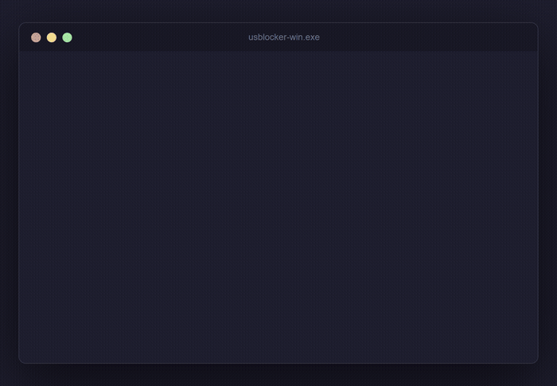
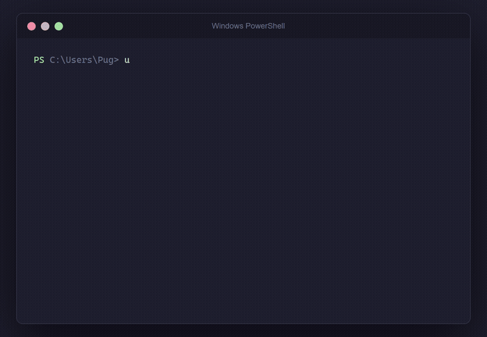

<p align="center">
  
  
  
  
  
</p>

<p align="center">
  
  
  
</p>

<h1 align="center">🔐 USB Locker</h1>

<p align="center">
  <strong>Your USB drive IS the key.</strong><br>
  Encrypt any file with military-grade AES-256-GCM. The decryption key lives <em>only</em> on your USB drive.<br>
  No USB plugged in? No access. Full stop.
</p>

---

## ✨ Features

- 🔒 **AES-256-GCM encryption** — the same standard used by governments and banks
- 🔑 **USB = key** — the decryption key never exists anywhere except your physical drive
- 🖱️ **Double-click to run** — interactive menu on launch, no terminal knowledge needed
- 💻 **CLI-first** — full command-line interface for power users and scripting
- 🌍 **Cross-platform** — standalone executables for Windows, Linux, and macOS
- 🔄 **One key, many files** — re-use the same USB key to lock as many files as you want
- 🛡️ **Tamper detection** — GCM auth tag catches any modification to encrypted files
- ✅ **37 automated tests** — crypto, USB detection, and full end-to-end workflows

---

## 🎬 See it in action

**Double-click the `.exe` — fully interactive, no terminal needed:**



**Or use it from the command line:**



---

## 📦 Download

Grab the latest pre-built binary from the [**Releases page**](https://github.com/pugplayzYT/usb-locker/releases/latest) — no Node.js required.

| Platform | File | How to run |
|---|---|---|
| **Windows** x64 | `usblocker-win.exe` | Double-click **or** run from CMD/PowerShell |
| **Linux** x64 (Debian/Ubuntu) | `usblocker_X.Y.Z_amd64.deb` | `sudo dpkg -i usblocker_*.deb` |
| **Linux** x64 (RHEL/Fedora) | `usblocker-X.Y.Z-1.x86_64.rpm` | `sudo rpm -i usblocker-*.rpm` |
| **macOS** x64 | `usblocker-macos.tar.gz` | `tar -xzf usblocker-macos.tar.gz && ./usblocker-macos` |

> **Windows SmartScreen warning?** Because the binary is open-source and unsigned, Windows may show an "Unknown Publisher" warning. Click **More info → Run anyway**. You're encouraged to review the full source code before running.

---

## 🚀 Quick start

### Lock a file

```bash
usblocker lock secret.pdf
```

Plug in your USB drive, select it from the list, and `secret.pdf.locked` is created. The AES-256 key is written to `usblocker.key` on the USB — that file is your key.

### Unlock a file

```bash
usblocker unlock secret.pdf.locked
```

Plug in the same USB drive. USB Locker auto-detects it, finds the matching key, and decrypts the file.

### List detected USB drives

```bash
usblocker list-drives
```

---

## 📖 CLI reference

### `usblocker lock <file>`

| Option | Description |
|---|---|
| `-k, --keep-original` | Keep the original unencrypted file (default: asks) |
| `-o, --output <path>` | Custom output path for the `.locked` file |
| `-d, --drive <path>` | Skip USB selection, use this drive path directly |

### `usblocker unlock <file.locked>`

| Option | Description |
|---|---|
| `-o, --output <path>` | Custom output path for the decrypted file |
| `-d, --drive <path>` | Skip USB auto-detection, use this drive path directly |

---

## 🔬 How it works

```
┌──────────────┐   lock    ┌──────────────────┐    ┌──────────────────────┐
│  plain file  │ ────────► │  file.locked     │    │  USB drive           │
└──────────────┘           └──────────────────┘    │  usblocker.key       │
                                                    │  ┌────────────────┐  │
                                                    │  │ keyId: uuid    │  │
                                                    │  │ key: 256-bit   │  │
                                                    │  └────────────────┘  │
                                                    └──────────────────────┘
Unlock only possible when the exact USB (with matching keyId) is present.
```

1. **Lock** — a fresh 256-bit AES-GCM key is generated and written to your USB as `usblocker.key`. The file is encrypted and saved as `<filename>.locked`.
2. **Unlock** — USB Locker scans connected USB drives, finds the one whose `keyId` matches the encrypted file header, and decrypts it. Wrong USB → decryption refused.

### Cryptographic details

| Property | Value |
|---|---|
| Algorithm | AES-256-GCM |
| Key size | 256 bit (32 bytes) |
| Nonce / IV | 96 bit (12 bytes), random per encryption |
| Auth tag | 128 bit (16 bytes) |
| Key storage | JSON on USB (`usblocker.key`) |

### `.locked` file format

```
Offset   Size    Field
0        4       Magic bytes  "USLK"
4        1       Format version (0x01)
5        4       Metadata JSON length (uint32 LE)
9        N       Metadata JSON  { keyId, iv, authTag, originalFilename, … }
9+N      rest    AES-256-GCM ciphertext
```

---

## 🛠️ Build from source

Requires [Node.js 18+](https://nodejs.org).

```bash
git clone https://github.com/pugplayzYT/usb-locker.git
cd usb-locker
npm install
npm run dev          # run without building
npm run build        # compile TypeScript → dist/
npm run bundle       # build + package → bin/ (all 3 platforms)
```

### Development commands

```bash
npm run dev           # run CLI via tsx (no build needed)
npm test              # run all 37 tests
npm run test:watch    # watch mode
npm run test:coverage # coverage report
npm run lint          # ESLint
npm run lint:fix      # ESLint auto-fix
```

### Git hooks (enforced automatically via Husky)

| Hook | What runs |
|---|---|
| `pre-commit` | ESLint — must pass |
| `pre-push` | Full test suite — must pass |

---

## 🗂️ Project structure

```
usb-locker/
├── src/
│   ├── index.ts              CLI entry (Commander + interactive menu)
│   ├── commands/
│   │   ├── lock.ts           lock command logic
│   │   └── unlock.ts         unlock command logic
│   └── lib/
│       ├── crypto.ts         AES-256-GCM encrypt/decrypt + file format
│       ├── usb.ts            USB detection (Win/Linux/macOS) + key R/W
│       └── types.ts          shared TypeScript interfaces
├── tests/
│   ├── crypto.test.ts        unit tests (19 tests)
│   ├── usb.test.ts           unit tests (12 tests)
│   └── integration.test.ts   end-to-end lock → unlock (6 tests)
└── docs/
    ├── demo-interactive.gif  double-click demo
    └── demo-cli.gif          CLI demo
```

---

## 🔒 Security notes

- **Never commit `usblocker.key`** — it is listed in `.gitignore`.
- The key file is plain JSON on the USB. **Physical access to the USB = access to the encrypted files.**
- AES-256-GCM provides both confidentiality and authenticity (tamper detection via auth tag).
- Each encryption uses a fresh random 96-bit nonce, so encrypting the same file twice produces completely different ciphertext.

---

## 📄 License

[MIT](LICENSE)
